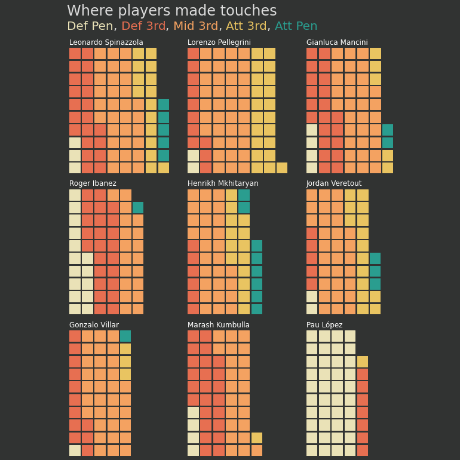
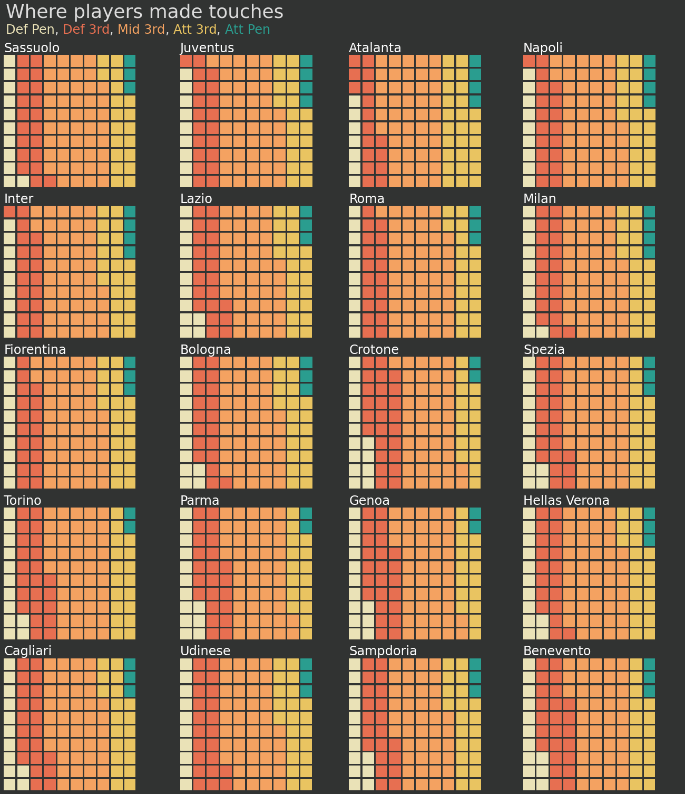

# Match analysis of player data from fbref using PyWaffle

Colourful plots created with the use of Python library - PyWaffle. The match data is scraped from fbref, using Pandas. The data is cleaned and preprocessed for the use of the visualisation.  
In each game whenever a player interacts with the ball his position is recorded on the pitch (5 sections : Def Pen, Def 3rd, Mid 3rd, Att 3rd, Att Pen). Each of those are represented with different colours on the plot.  
The players are ordered by the number of times they touched the ball during the match. (Match : 2021 January, Roma - Verona)

All this data is available for the teams for the whole season. After processing a clear % ratio can be generated for each club. 

## Roma's top 9 players

## Each team's distribution of ball interactions on the field (Serie A 20/21; 2021 Feb)

